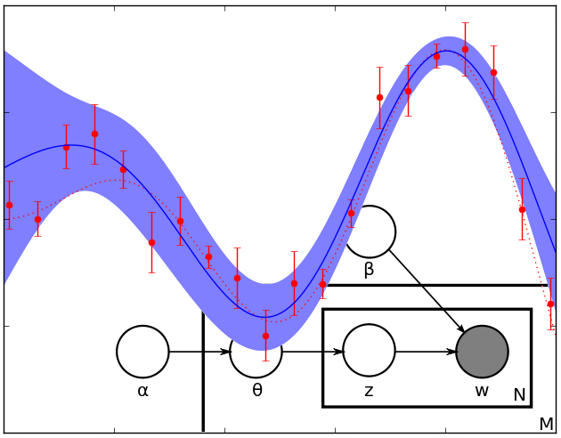

---
# Course title, summary, and position.
linktitle: BA MAUCA
summary: Learn how to use Bayesian formalism to model and solve a problem.
weight: 6

# Page metadata.
title: Bayesian analysis. Application to image reconstruction
date: "2018-09-09T00:00:00Z"
lastmod: "2018-09-09T00:00:00Z"
draft: false  # Is this a draft? true/false
toc: true  # Show table of contents? true/false
type: docs  # Do not modify.

# Add menu entry to sidebar.
# - name: Declare this menu item as a parent with ID `name`.
# - weight: Position of link in menu.
menu:
  example:
    name: BA MAUCA
    weight: 6
---

This course is taught to [MAUCA](http://mauca.unice.fr) students.

## Abstract

The course aims to familiarize the students with the Bayesian analysis.
The Bayesian paradigm, coupled with efficient simulation algorithms,
has been proved to be a computationally efficient alternative to
classical frequentist approaches.

The Bayesian formalism is also recognized as a  natural framework to address inverse problems
which arise in many observational systems.
A large part of the course is devoted to the application of Bayesian models
to image reconstruction in astrophysics. It will particularly focus on choice of the priors
and the implementation.

## Theory

A common problem in experimental and observational sciences is to
extract information from noisy measurements. Bayesian analysis is
the formalism which allows to merge in the inference: 1. the information
brought by the measurements, 2. a prior on the solution.

This approach is experiencing an increasing interest since 
the early 1990's after new simulations methods appeared. Since a decade,
the Bayesian paradigm coupled with hierarchical models is used to
solve computationally involving problems where mathematical
optimization algorithms are replaced by increasingly effective simulations methods.

Besides the power of recent computational Bayesian approaches,
the Bayesian formalism plays also a central role in the resolution of inverse problems.

Many data processing problems in physics, and in particular in astrophysics, 
can be formalized as an inverse problem where the measured data is related in a complex way to the properties of the target.
This includes image deconvolution (e.g. deblurring and denoising), 
image reconstruction (e.g. in radioastronomy or optical interferometry), image segmentation...
The resolution of these ill-posed problems require a regularization (or prior) 
and the Bayesian formalism is proved to be the natural framework to address these problems.

## Applications

A large part of the course is devoted to practical projects, where the students 
will code various algorithms and compare theoretical results with simulation results.
Students will have to complete three projects during the course and are welcomed to 
work in pairs and to submit a single document. The computations will be 
preferentially carried out in julia, python or matlab.  
