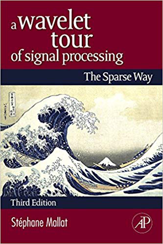

---
# Course title, summary, and position.
linktitle: DSIP MAUCA M1
summary: Learn how to analyze signals and images using numerical tools.
weight: 4

# Page metadata.
title: Digital Image and Signal Processing
date: "2018-09-09T00:00:00Z"
lastmod: "2018-09-09T00:00:00Z"
draft: false  # Is this a draft? true/false
toc: true  # Show table of contents? true/false
type: docs  # Do not modify.

# Add menu entry to sidebar.
# - name: Declare this menu item as a parent with ID `name`.
# - weight: Position of link in menu.
menu:
  example:
    name: DSIP MAUCA1
    weight: 4
---

This course is taught to [MAUCA1](http://mauca.unice.fr) students.

## Course textbooks

The course will cover parts of:

> Discrete-Time Signal Processing (3rd Edition) 
>  Alan V. Oppenheim, Ronald W. Schafer, and John R. Buck. 
> Prentice-Hall Signal Processing Series

and

> A Wavelet Tour of Signal Processing: The Sparse Way
> Stéphane Mallat, Academic Press Inc.
