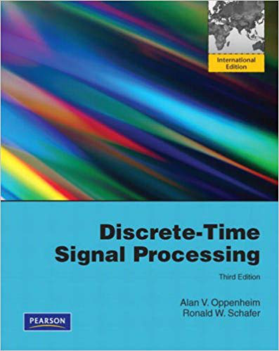

---
# Course title, summary, and position.
linktitle: DSIP MAUCA M1
summary: Learn how to analyze signals and images using numerical tools.
weight: 4

# Page metadata.
title: Digital Image and Signal Processing
date: "2018-09-09T00:00:00Z"
lastmod: "2018-09-09T00:00:00Z"
draft: false  # Is this a draft? true/false
toc: true  # Show table of contents? true/false
type: docs  # Do not modify.

# Add menu entry to sidebar.
# - name: Declare this menu item as a parent with ID `name`.
# - weight: Position of link in menu.
menu:
  example:
    name: DSIP MAUCA1
    weight: 4
---

This course is taught to [MAUCA1](http://mauca.unice.fr) students.

The objective of this course is to present the fundamental mathematics and concepts of discrete-time signal and image processing. 
These topics are presented in the context of signal processing and extended to image processing. 
A large part of the course will be devoted to computer implementation of signal and image processing systems.

## Content 

- Discrete-Time Signals and Systems
1. Properties of systems
2. Linear and Time Invariant (LTI) systems. Convolution
3. Linear Constant-Coefficients Difference Equations
4. Frequency response of a stable LTI
- The z-Transform and Filter Design
1. z-transform Properties. Properties of the ROC
2. z-transforms and LTI Systems
3. Design of Discrete-Time IIR Filters and design of FIR Filters
- The Discrete Fourier Transform
1. Representation of Periodic Sequences: The Discrete Fourier Series 
2. Fourier Representation of Finite-Duration Sequences
3. Properties of the DFT, Linear Convolution Using the DFT
4. Computation of the Discrete Fourier Transform and FFT Algorithms 
- Image processing
1. Convolutions in Space Domain and Fourier Domain
2. Matrix Representation of Convolution and properties 
3. Elementary image transforms, edge detection
4. Image filtering
- Introduction to Wavelets
1. Time frequency analysis
2. Continuous and discrete wavelets transform
3. Multi-resolution analysis

## Practical work

A large part of the course is devoted to 4 practical projects, where the students will code various algorithms and compare theoretical results with simulation results.  
1. Signal filtering
2. Fourier analysis and circular convolution
3. Image processing
4. Wavelets analysis

Students will have to complete these projects during the course and are welcomed to work in pairs and to submit a single document. The computations will be preferentially carried out in julia or python.

## Course textbooks

The course will cover parts of:

> Discrete-Time Signal Processing (3rd Edition) 
>  Alan V. Oppenheim, Ronald W. Schafer, and John R. Buck. 
> Prentice-Hall Signal Processing Series

and

> A Wavelet Tour of Signal Processing: The Sparse Way
> Stéphane Mallat, Academic Press Inc.
