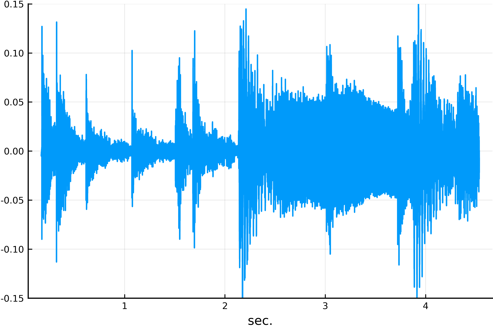
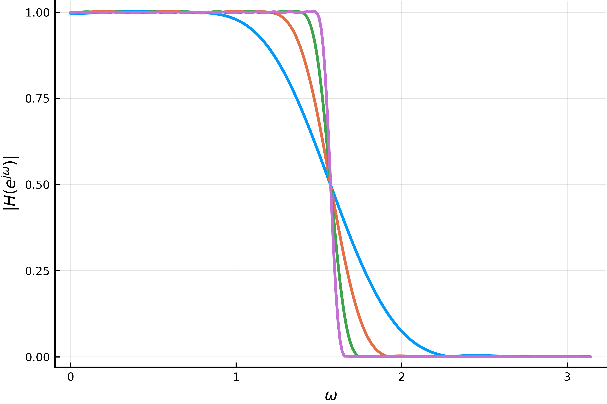
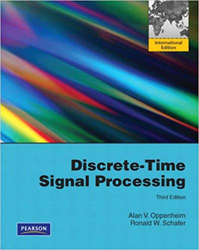

---
# Course title, summary, and position.
linktitle: DSP ELEC3
summary: Learn how to analyze signals using filters and Fourier transforms.
weight: 1

# Page metadata.
title: Digital signal processing
date: "2018-09-09T00:00:00Z"
lastmod: "2018-09-09T00:00:00Z"
draft: false  # Is this a draft? true/false
toc: true  # Show table of contents? true/false
type: docs  # Do not modify.

# Add menu entry to sidebar.
# - name: Declare this menu item as a parent with ID `name`.
# - weight: Position of link in menu.
menu:
  example:
    name: DSP ELEC3
    weight: 1
---

This course is taught to Licence 3 [EEA](http://www.unice.fr/elec/) students.

## Desription

This course will introduce the students to the fundamental of discrete-time signal processing. 
It will particularly focus on:
- Discrete-time signals and systems, convolution
- The z-transform
- Sampling of continuous-time signals
- Transform analysis of linear time-invariant systems
- Fourier transforms: FT, DFT and FFT
- Introduction to filter design techniques.

A large part of the course is devoted to practical projects, where the students will code various algorithms and compare theoretical results with simulation results.

## Piazza

All the annoucements will be posted on Piazza. Students are also encouraged to post questions on Piazza.

## Homework

Students will have to complete a project during the course. You must submit for each project a pdf export of a jupyter notebook including the code, plots and a detailed report. Your are welcomed to work in pairs and to submit a single document.

Due dates will be posted on the website along with the assignments. Late homework will not be accepted.

## Software

In this course we will be using [Julia](https://julialang.org). 

## Course textbooks

The course will cover parts of:

> Discrete-Time Signal Processing (3rd Edition) (Prentice-Hall Signal Processing Series)
>  Alan V. Oppenheim, Ronald W. Schafer, and John R. Buck. amazon