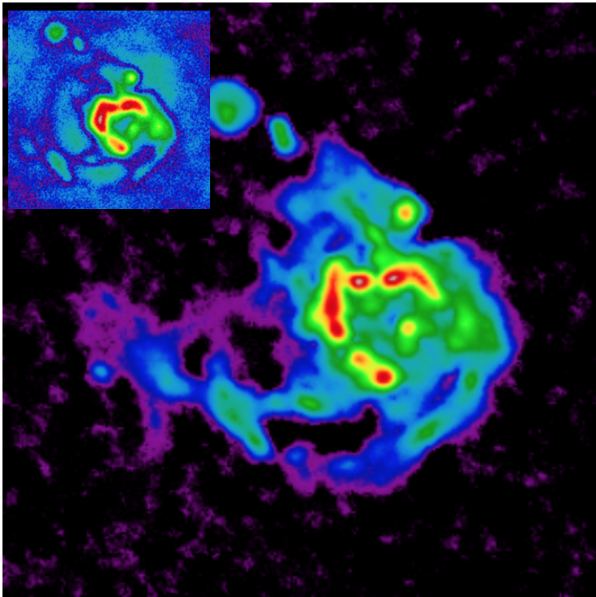

---
# Course title, summary, and position.
linktitle: IP ESTEL2
summary: Learn how to numerically solve an inverse problem to reconstruct an image.
weight: 2

# Page metadata.
title: Inverse problems and imaging
date: "2018-09-09T00:00:00Z"
lastmod: "2018-09-09T00:00:00Z"
draft: false  # Is this a draft? true/false
toc: true  # Show table of contents? true/false
type: docs  # Do not modify.

# Add menu entry to sidebar.
# - name: Declare this menu item as a parent with ID `name`.
# - weight: Position of link in menu.
menu:
  example:
    name: IP ESTEL2
    weight: 2
---

This course is taught to Master 2 [ESTEL](http://www.unice.fr/elec/) students.

## Description 

The objective of this course is to present a unified approach to solve inverse problems in imagery.

## Content

1. 	Introduction of image processing
	- Elementary image transforms, edge detection
	- Convolutions in space domain and Fourier domain, border conditions
	- Matrix representation of convolution and properties
	- Inverse problem formalism, regularization
2.	Introduction to convex optimization
	- Convexity of sets and functions
	- Convex optimization problem
	- Duality and KKT conditions
	- Descent algorithms, projected gradient
	- Interior point algorithms
3.	Application to deconvolution
	- Tikhonov regularization and Wiener filtering
	- ISRA algorithm
4. Image reconstruction in radioastronomy
	- Basics of radio-interferometry 
	- Effects of long baselines and wide field of view
	- Measurement model and algorithms

## Practical work

A large part of the course is devoted to practical projects, where the students will code various algorithms and compare theoretical results with simulation results. The computations will be preferentially carried out in julia or python.

