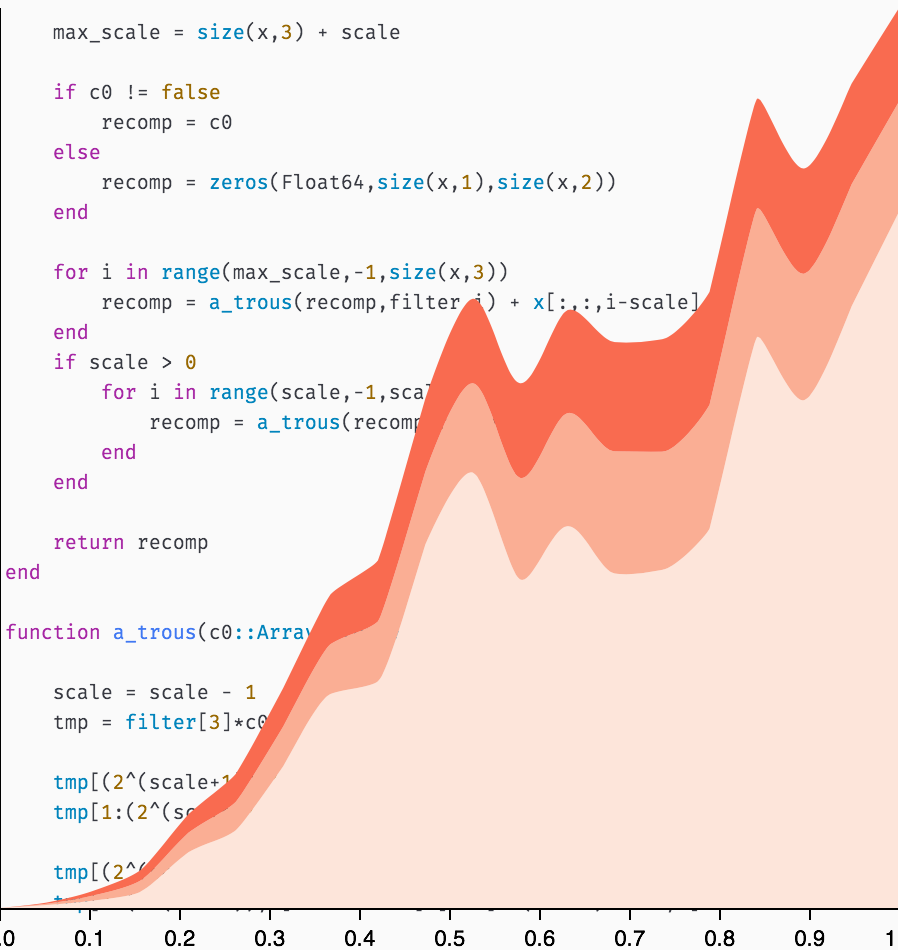
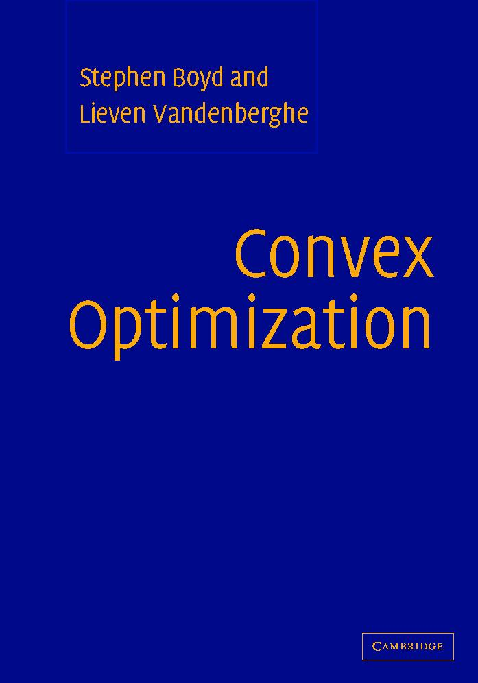

---
# Course title, summary, and position.
linktitle: OPTIM MAUCA
summary: Learn how to numerically solve an optimization problem.
weight: 5

# Page metadata.
title: Numerical optimization with applications 
date: "2018-09-09T00:00:00Z"
lastmod: "2018-09-09T00:00:00Z"
draft: false  # Is this a draft? true/false
toc: true  # Show table of contents? true/false
type: docs  # Do not modify.

# Add menu entry to sidebar.
# - name: Declare this menu item as a parent with ID `name`.
# - weight: Position of link in menu.
menu:
  example:
    name: OPTIM MAUCA
    weight: 5
---

This course is taught to [MAUCA](http://mauca.unice.fr) students.

## Abstract

Numerical optimization is a central tool for many practical problems, e.g. inverse problems in astrophysics such as image deconvolution, image reconstruction for radio or optical interferometers... instrumental design such as coranographs... 
	
More generally optimization arises in most of the estimation problems where the task consists in estimating unknown quantities from  noisy and distorted measurements or learning a model from training samples  e.g. for a classification task  as in deep neural networks.

A large part of the course will be devoted to mathematical optimization which consists of deriving an algorithm to numerically minimize a cost function over a defined domain. It will particularly focus on the implementation striking a balance between theory and coding.

## Objectives

The main objective is to be able to derive a possibly optimal algorithm to solve a given practical estimation problem. This includes the formulation as a standard optimization problem, identification of the most appropriate optimization algorithm, coding and critical analysis of the results.

Students will learn convex optimization theory and how to formalize specific inverse problems and machine learning tasks as optimization problems. They will learn to code efficiently the related algorithms, specially for large scale problems.

## Prerequisites

- Signal/image processing, 
- Fourier optics, 
- Numerical methods (python), 
- Maths/Stat (Statistical methods for signal and noise).

## Theory

The course includes:
- Basics of convex optimization including duality.
- Constraint and unconstraint optimization algorithms with convergence analysis.
- Stochastic optimization  and automatic differentiation to solve large scale problems such as machine learning problems.

## Applications

- Applications will include practical work sessions where the student
will become familiar with the development environment and will learn
to code toy problems. 

- The course will also include a personal project where the student will
have to solve a real problem. Examples from the past courses are 
optimization of an apodized Liot coranograph and HST image deconvolution.
Other possible projets are: morphological galaxy classification using machine learning, 
image reconstruction for radio-interferometry...

## Main progressions steps

- First third of the period: theoretical courses. They consists in lectures and
personal work on textbooks.
- Second third of the period: theoretical courses with practical work sessions.
- Last third of the period: project.

## Evaluation

- A written exam week 4 on the theoretical part (40 \%).
- Evaluation of the practical work sessions (20 \%). 
- Evaluation of the project (20 \%). 
- Evaluation of the project during the global oral presentation (20\%).

## Textbook 

The course will cover parts of:
> Convex Optimization, Stephen Boyd and Lieven Vandenberghe
> Cambridge University Press

A pdf version of the book and more material can be download from the book [site](https://web.stanford.edu/~boyd/cvxbook/).

