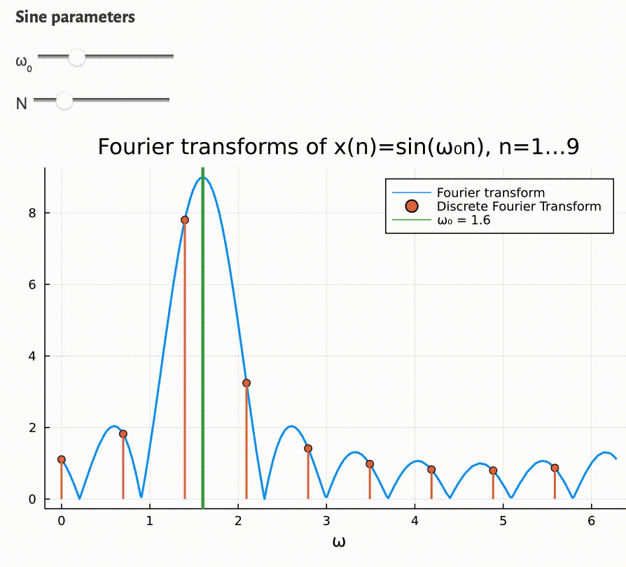

Fourier transforms of a sine wave using a [Pluto.jl](https://github.com/fonsp/Pluto.jl) notebook:

The interactive notebook can be run on [binder](https://binder.plutojl.org/v0.19.12/open?url=https%253A%252F%252Fgist.githubusercontent.com%252Fandferrari%252F11a67e9211844f3ceea017042169b0b5%252Fraw%252F0256fb0a4679a17ce8b9589d9ce3b8be1203c40d%252Fdft.jl), but be patient 😴.

```julia
begin
  using Plots, PlutoUI

  function DFT_plot(ω₀, N)
    f(ω) = abs(sin(N*ω/2)/sin(ω/2))
    ω_DFT = (0:N-1)*2π/N
    plot(ω -> f(ω - ω₀), 0, 2π, label="Fourier transform", xlabel="ω", w=2)
    plot!(ω_DFT, f.(ω_DFT .- ω₀), line = :stem, 
      label="Discrete Fourier Transform", marker = :circle, w=2)
    vline!([ω₀], label="ω₀ = $(round(ω₀, digits=2))", w=3)
    title!("Fourier transforms of x(n)=exp(jω₀n), n=1…$N")
  end
end
```

```julia
begin
  ω₀Slider = @bind ω₀ Slider(0:1E-2:2π, default = 0.7)
  NSlider = @bind N Slider(4:30, default = 10)

  md"""**Sine parameters**
  
  ω₀ $ω₀Slider
  
  N $NSlider
  """
end
```

```julia
DFT_plot(ω₀, N)
```
