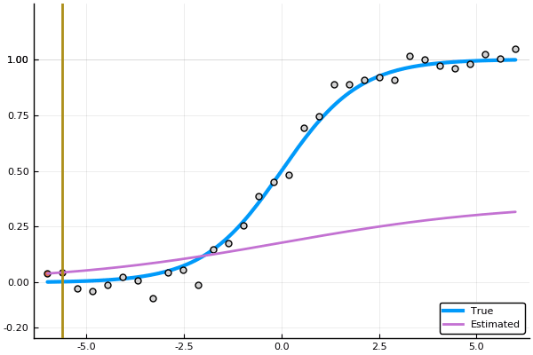

Inspired by the nice [tweet](https://twitter.com/clcrozier/status/1251148890595708938?s=21) of Constance Crozier,
here is the julia code to illustrate the fit of a sigmoid as a function of the number of samples.




```julia 
using Plots, LsqFit

@. σ(x, θ) = θ[1]/(1 + exp(-θ[2]*x))

x_plot = range(-6,stop=6,length=128)
y_plot = σ(x_plot, [1, 1])

n = 32
xdata = range(-6,stop=6,length=n)
ydata = σ(xdata, [1 1]) + 0.05*randn(n)

anim = @animate for i in 2:n
    θ_est = coef(curve_fit(σ, xdata[1:i], ydata[1:i], [1.0, 1.0]))
    
    plot(x_plot, y_plot, label="True", legend=:bottomright, ylims=(0, 1.25), w=3)
    scatter!(xdata[1:i], ydata[1:i], label="", ms = 5)
    scatter!(xdata[i+1:end], ydata[i+1:end], label="", mc = :lightgray, ms = 5)
    plot!(x_plot, σ(x_plot, θ_est) , label="Estimated", w=2)
    vline!([xdata[i]], label="", w=2)
end
gif(anim, "sigmoid_fit.gif", fps = 10)
``` 

